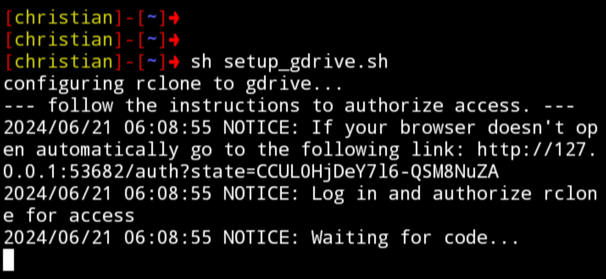
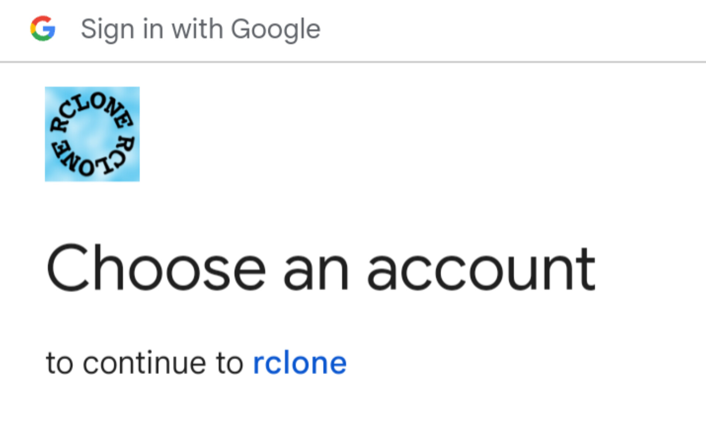
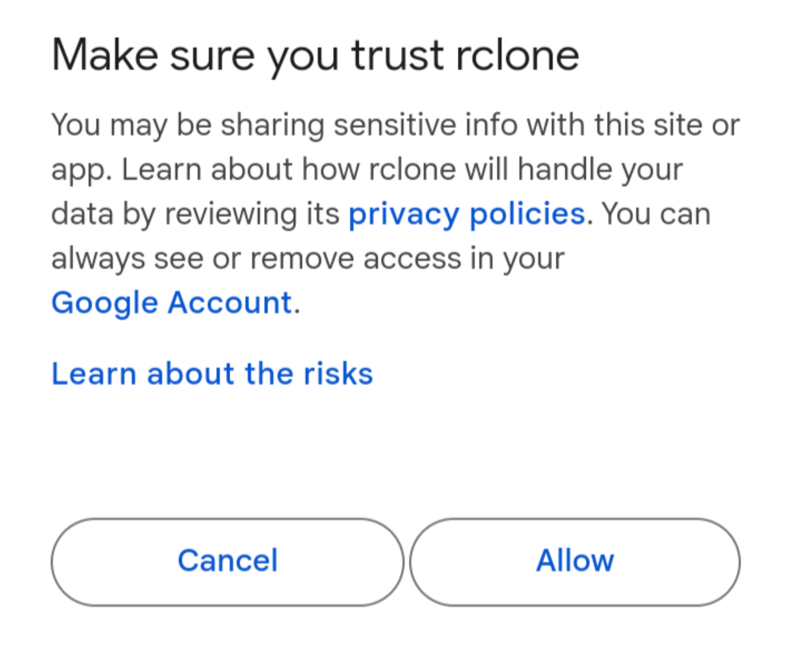
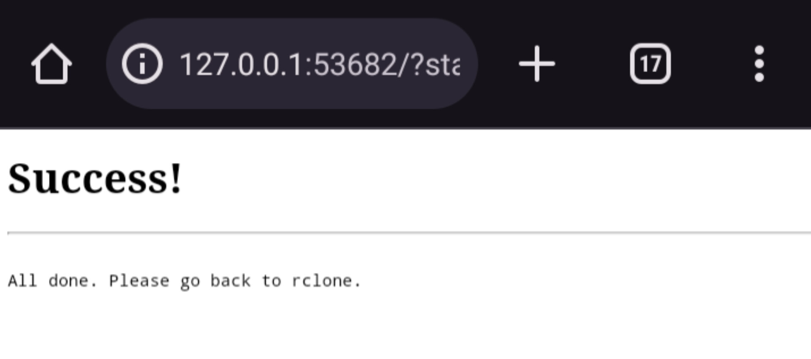
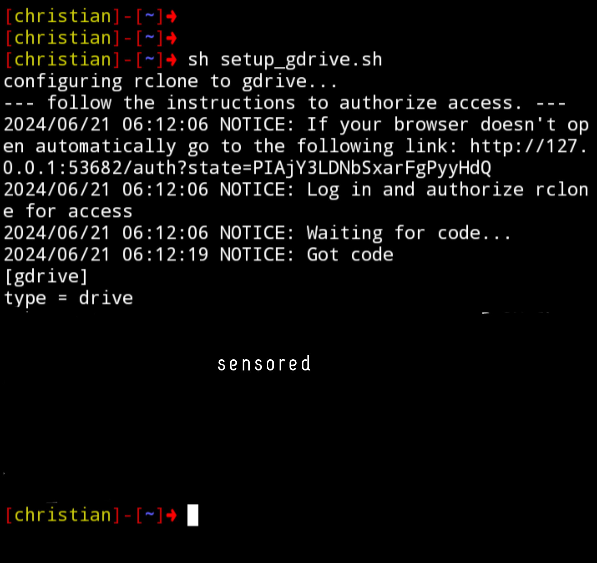
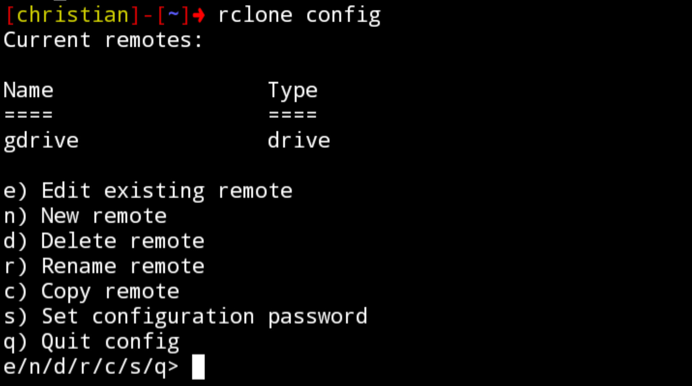

# Configure Google Drive

> run the script:

> after running the script, it will redirect you to your web browser to set up your google account.

> click `allow` to enable access to your google drive.

> you will see a success message after allowing access to your account.

> go back to your termux terminal for `rclone` configuration

> run $ `rclone config` for configuration

## Contributions

Feel free to open issues or submit pull requests for improvements and bug fixes.

## License

## Author

